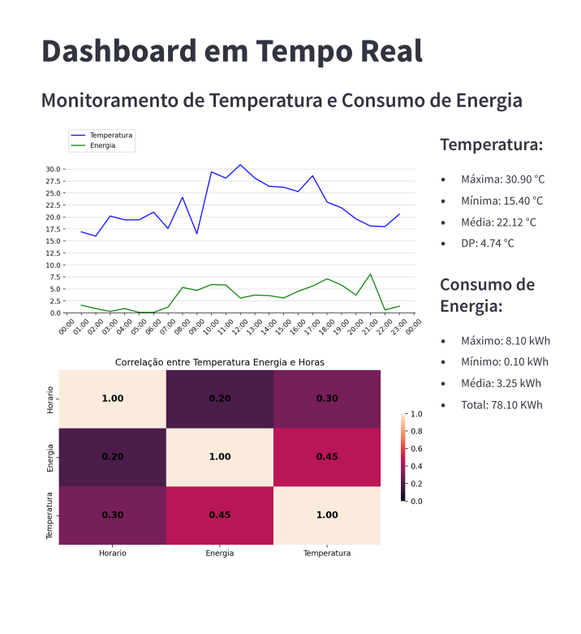

# **Exemplo do Dashboard ao final do dia**
[](dashboard.pdf)
---
# Dashboard de Monitoramento em Tempo Real

Este projeto é um **dashboard interativo** desenvolvido em Python utilizando a biblioteca **Streamlit**. Ele monitora dados de temperatura e consumo de energia em tempo real, apresentando gráficos e métricas de maneira clara e intuitiva.

---

## 🚀 Funcionalidades

- **Atualização em Tempo Real**: Atualiza automaticamente os dados a cada 5 segundos.
- **Gráficos Dinâmicos**:
  - Linha do tempo para temperatura e consumo de energia.
  - Heatmap de correlação entre variáveis.
- **Métricas Detalhadas**:
  - Temperatura: máxima, mínima, média e desvio padrão.
  - Consumo de energia: máximo, mínimo, média e total acumulado.

---

## 📂 Estrutura do Projeto

### 🛠 Principais Tecnologias

- **Streamlit**: Para criação do dashboard.
- **Pandas**: Manipulação e transformação dos dados.
- **Matplotlib** e **Seaborn**: Visualização de dados com gráficos estilizados.

### 🧩 Arquitetura do Código

- **Carregamento de Dados**: 
  - Os dados são carregados de um arquivo CSV (`df_temperatura_energia.csv`) usando a função `@st.cache_data` para otimizar a performance.
- **Gráficos**: 
  - Gráfico de linhas para visualização da evolução das variáveis ao longo do tempo.
  - Heatmap de correlação para explorar as relações entre temperatura e energia.
- **Métricas**:
  - Exibição de indicadores de desempenho diretamente no painel lateral.

---

## 🖥 Requisitos

### 🧑‍💻 Instalação

Certifique-se de ter o Python 3.8+ instalado e as bibliotecas necessárias. Instale os requisitos com:

```bash
pip install -r requirements.txt
```

Execute o comando:
```bash
python run.py
```

O dashboard irá abrir automaticamente no navegador.